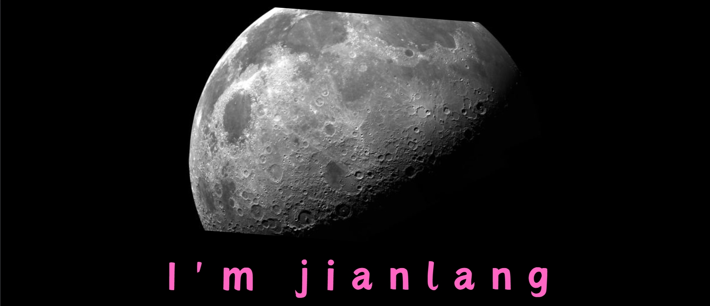

  

    
  

 

# 👋 Hi, I'm jianlang

> Passionate about building scalable web solutions and contributing to the open-source community

---

## 🛠️ 技术工具 & 技能 {#技术工具--技能}

     

---

## 📌 精选项目 {#精选项目}

<a href="https://github.com/jianlang829/awesome-Book-of-Destiny" style="color:#bbb; text-decoration:none;" class="hover-effect">项目A</a> - 揭示了“命运书”中的智慧 
<a href="https://github.com/jianlang829/Awesome-Windows-Laptop-Network-Optimizer" style="color:#bbb; text-decoration:none;" class="hover-effect">项目B</a> - 适用于Windows 10（1903+）/Windows 11（21H2+）笔记本的网络优化脚本集合 
<a href="https://github.com/jianlang829/awesome-Math-and-Computer-Sci" style="color:#bbb; text-decoration:none;" class="hover-effect">项目C</a> - 微分方程数值求解工具集

---

## 📊 GitHub数据统计 {#github数据统计}

---

## 🔥 贡献记录 {#贡献记录}

---

## 📫 联系我 {#联系我}

  
  

